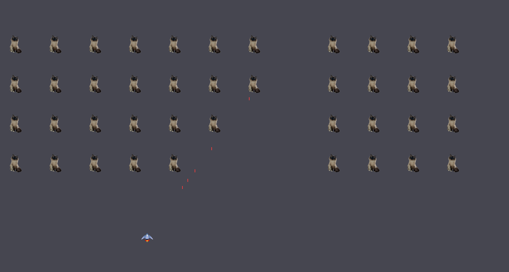

# Alien Invasion 👾




A classic space shooter built with **Pygame** where you defend Earth against waves of invading felines.

## Features
* Progressive difficulty - aliens speed up as you advance
* Score tracking and high score system
* Multiple lives

## Quick Start
```bash
git clone git@github.com:Mohamed-Elwasila/Alien_Invasion.git
cd Alien_Invasion
sudo apt install python3-pygame  # Ubuntu/Debian
# or: pip install pygame
python3 src/Alien_invasion.py
```

## Controls
* **← / →** or **A / D** → Move Left / Right
* **Space** → Shoot
* **Q** → Quit
* **P** → Pause 

## Requirements
* Python 3.x
* Pygame 2.x


